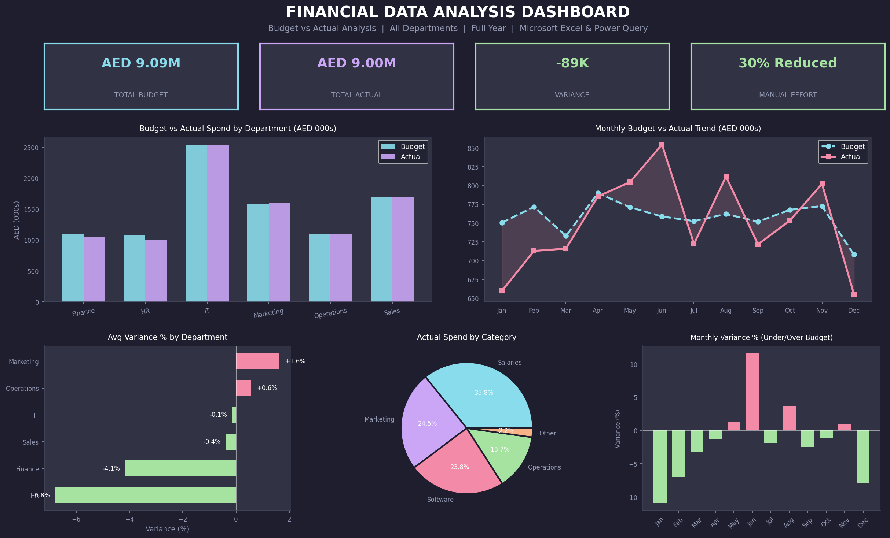

# Financial Data Analysis

*Tools:* Python · Pandas · NumPy · Matplotlib · Excel · Power Query

## Overview
Processed and analyzed financial datasets across 6 departments
to generate insights on budget variance, cost distribution, and
spending patterns. Automated reporting workflows reduced manual
effort by 30%.

## Key Results
- Analyzed *72 records* across 6 departments — full year
- Reduced manual reporting effort by *30%* through automation
- Identified departments running over and under budget
- Generated actionable insights on cost distribution and spending

## Dashboard Preview

## Analysis Includes
- Budget vs Actual comparison by department
- Monthly spend trend analysis
- Variance tracking (over/under budget)
- Spend breakdown by category (Salaries, Software, Marketing)

## Files
- financial_analysis_script.py — Full Python analysis script
- financial_data.csv — Financial dataset (72 records, 6 departments)

## How to Run
1. Download financial_analysis_script.py
2. Run: python financial_analysis_script.py
